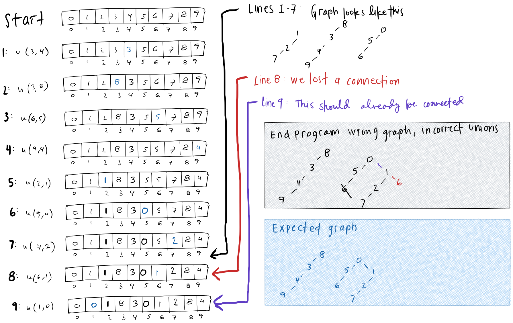

# Union-find programs

## `QuickUnion.java`

- Input: 
    - the number of elements
    - a list of pairs to union
- Output: 
    - a model representing all connections

## Learnings from `QuickUnion.java`

### How do I handle cycles?

Initially, code for `union(int a, int b)` and `find(int a)` looked like this. What happens if there's a cycle? Then `find` would be in an endless loop. 

```java
public int find(int a) {
    int val = arr[a];
    
    while (val != arr[val]) {
        val = arr[val];
    }
    
    return val;
}

public void union(int a, int b) {
    arr[a] = b;
}
```

Checking if two values are connected already should help prevent cycles
```java
public void union(int a, int b) {
    if (connected(a,b)) return;
    arr[a] = b;
}
```

### How do we keep track of components? Do I need to?

While in some situations we may want to see the components, in this case we only cared about the count.

To get the number of components, you only need an int that tracks it. Initially, the count will equal the size of the array. For each union, the count decreases by 1. 

### Resolved issue: Losing connections

While testing, I was expecting 2 components, but only got 1. Figuring out what went wrong required a lot of stepping through the code. 

The problem is when we set `arr[a] = b`, it overwrote the previous value at `arr[a]`. If the previous value was not the same component as `b`, then we accidentally switch [a] to another component, rather than joining the two components. 

This image shows stepping through the code for an array size 10. 


Here is the original code.
```java
public void union(int a, int b) {
    if (connected(a,b)) return;

    arr[a] = b;
    count--;
}
```

Here is the corrected code. Instead of setting `arr[a]` to `b`, we connected it at the root of `a`.
```java
public void union(int a, int b) {
    if (connected(a,b)) return;

    arr[find(a)] = b;
    count--;
}
```
